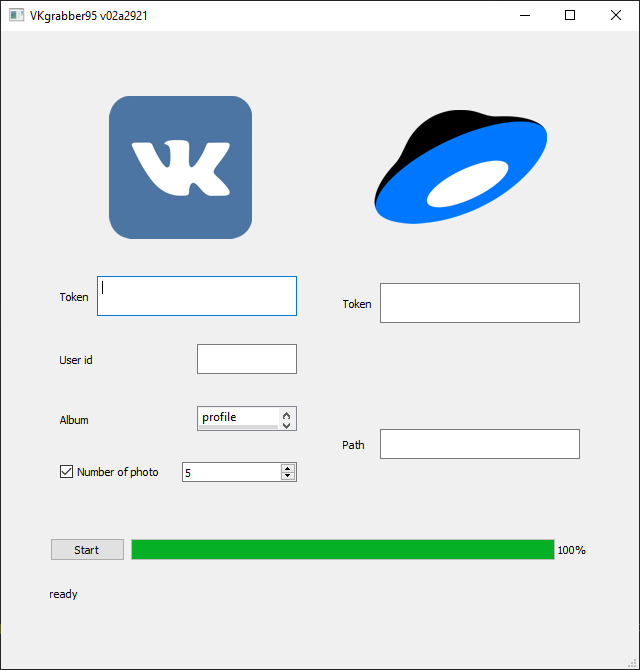

# Задание на дипломный проект «Резервное копирование» первого блока «Основы языка программирования Python»

Утилита написана на языке Python реализует возмоность сохранения изображений из социальной сети Вконтакте в облачное хранилище Яндекс диск. Пии разработке использовалось официальное API VK и REST API Яндекс.Диска.  

## внешние модули

* pyQt5
* reqursts

### для установки

    python -m pip install pyqt5
    python -m pip install reqursts

## функции

* Получение изображений из альюомов пользователя;
* Сохранение фотографии максимального размера в указаннаю директорию Я.Диске.
* В качестве имени фотографий используются количество лайков;
* В случае одинакового количества к названию добавляется дата и время публикации;
* Информация о загруженных изображениях сохроняется в json-файл;
* В случае если загружаемый файл уже пристутсвует на в директории, файл пропускается;
* Графический интерфейс поддерживает отображение текущих действий и общего прогресса выполнения загрзки;
* Поддерживается сохранения последних параметров введённых пользователем;
* В случае отсутсвия на диске указанной диретории, она создаётся;
* поддержка ограничения количества загружаемых изображений за сессию;
* Графический интерфейс оптимизируется под разрешение экрана;

## Диалоговый интерфейс



Требование:
> Сохранять указанное количество фотографий(по умолчанию 5)

Реализуется таким образом что при отсутсвие галочки ```number of photo``` происходит ззагрузка всех найдных изображений. В случае установки галочки ```number of photo``` значение по умолчанию становится ```5```.
